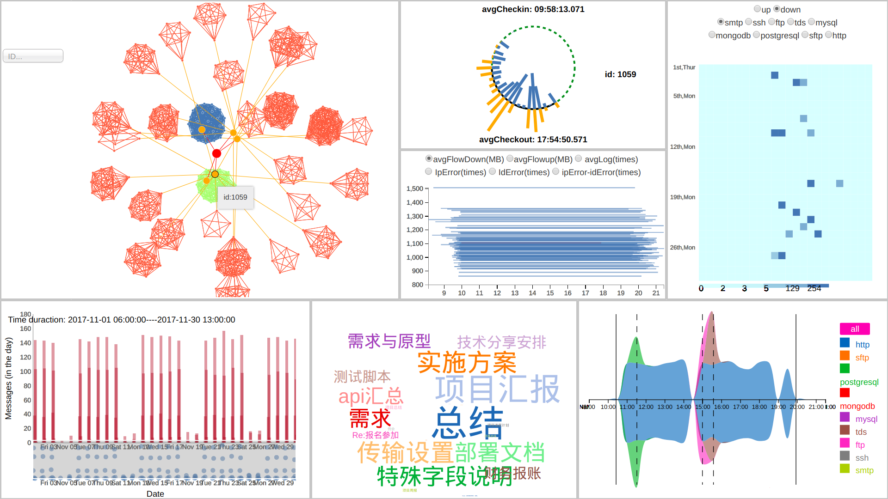

# ChinaVis2018
## Requirements
- [jdk1.8](http://www.oracle.com/technetwork/java/javase/downloads/jdk8-downloads-2133151.html)
- [MySQL](https://www.mysql.com/)
- [d3.js](https://d3js.org/)

## Usage
- Load NewNewchinavis2018db file into MySQL
- Activate chinaVis2018-0.0.1-SNAPSHOT.jar 
```
java -jar chinaVis2018-0.0.1-SNAPSHOT.jar
```
- Open index.html file with Chrome browser

## Layout 


<figure class="half">
    
    
</figure>